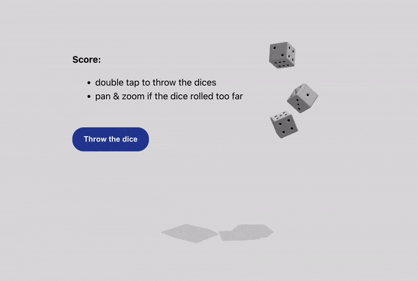

# Dice roller with Three.js and cannon-es

Demo for the tutorial on how to code a dice cube and realistic dice roller

[Article on Codrops](https://tympanus.net/codrops/?p=69521)

[Demo](http://tympanus.net/Tutorials/DiceRoller/)

## Installation

No package manager / build system is needed.
You can run the page as it is on local server (any web server, really).

The page is using the following libs:

1) Three.js + their addons OrbitControls and mergeBufferGeometries.
   https://threejs.org/docs/#manual/en/introduction/Installation

2) cannon-es
   https://github.com/pmndrs/cannon-es

Both tools are added as JS modules via CDN with import map. Other installation options are available (see the links above)

## Misc

Follow Ksenia: [Twitter](https://twitter.com/uuuuuulala), [Codepen](https://codepen.io/ksenia-k), [website](https://ksenia-k.com/)

Follow Codrops: [Twitter](http://www.twitter.com/codrops), [Facebook](http://www.facebook.com/codrops)
, [GitHub](https://github.com/codrops), [Instagram](https://www.instagram.com/codropsss/)

## License

[MIT](LICENSE)

Made with :blue_heart:  by [Codrops](http://www.codrops.com)

